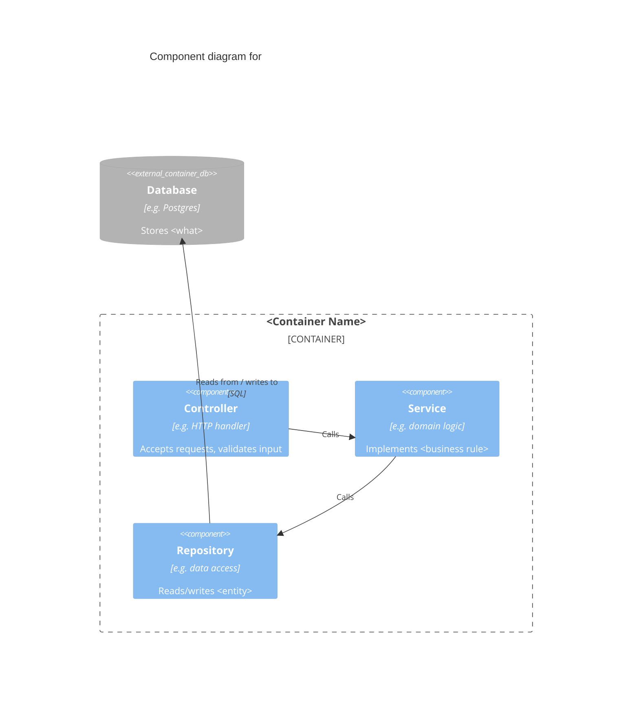

<!-- TEMPLATE — copy to component-<container-slug>.md and fill in. Delete these comments when done. -->
# Component Diagram — \<Container Name\>

**Level:** 3 — Component
**Owner:** \<team/person\>
**Last updated:** \<YYYY-MM-DD\>

One paragraph: the internal building blocks of this container and their responsibilities.

## Notes

- Document non-obvious internal contracts: idempotency, retries, invariants a component relies on.
