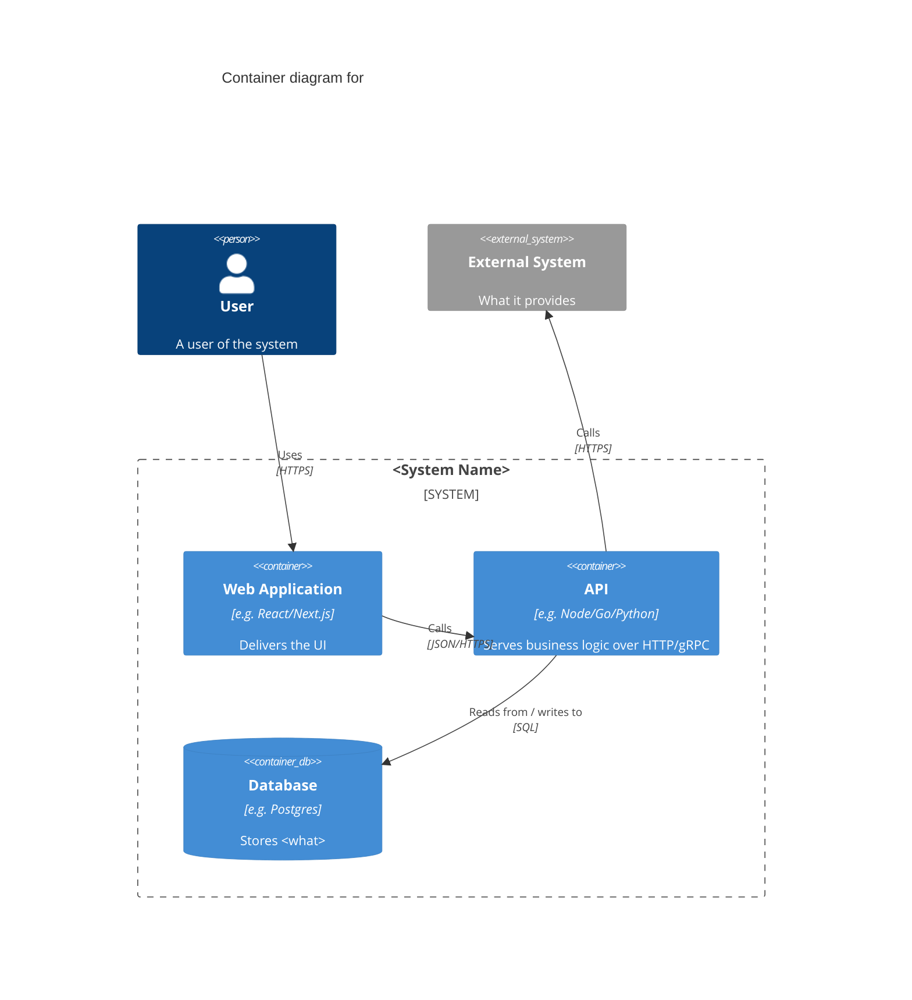

<!-- TEMPLATE — copy to container-<system-slug>.md and fill in. Delete these comments when done. -->
# Container Diagram — \<System Name\>

**Level:** 2 — Container
**Owner:** \<team/person\>
**Last updated:** \<YYYY-MM-DD\>

One paragraph: the applications/services/stores inside the system boundary and how they fit together.

## Notes

- Call out anything relevant to how containers actually run: deployment target, scaling model, sync vs async communication.
