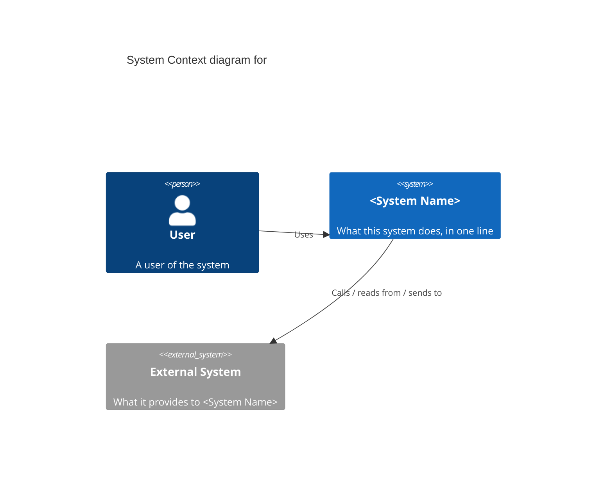

<!-- TEMPLATE — copy to context-<system-slug>.md and fill in. Delete these comments when done. -->
# Context Diagram — \<System Name\>

**Level:** 1 — System Context
**Owner:** \<team/person\>
**Last updated:** \<YYYY-MM-DD\>

One paragraph: what this system does and for whom.

## Notes

- List anything the diagram can't show: authentication method with each external system, SLAs, data classification, etc.
